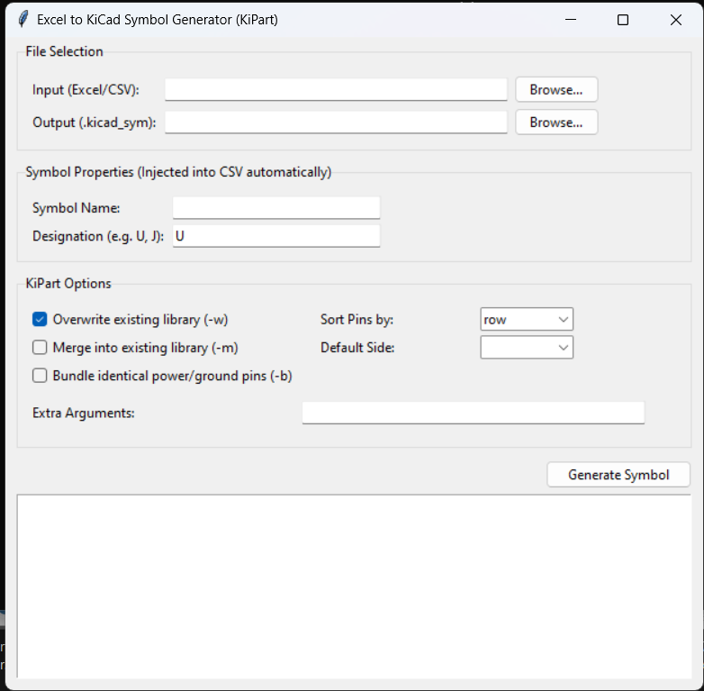

# Excel to KiCad Symbol Generator

A professional GUI utility for converting Excel or CSV pinout tables into KiCad symbol libraries using the excellent `KiPart` backend.

This tool automates the repetitive and error-prone process of manually creating schematic symbols in KiCad by allowing engineers to prepare pin definitions in Excel and generate `.kicad_sym` libraries directly.

---

# GUI Preview

> Replace the image below with your actual GUI screenshot.

```markdown
# GUI Preview

```

Recommended repository structure:

```text
project-root/
│
├── assets/
│   └── gui_preview.png
│
├── excel_to_kicad_symbol.py
└── README.md
```

---

# Features

* Excel (`.xlsx`, `.xls`) support
* CSV input support
* Automatic KiPart-compatible CSV formatting
* Automatic header detection
* Cleans malformed Excel sheets and ghost cells
* GUI-based workflow using Tkinter
* Generates KiCad `.kicad_sym` libraries
* Supports overwrite and merge modes
* Pin sorting options
* Default pin-side assignment
* Bundle identical power/ground pins
* Real-time execution logs
* Automatic symbol property injection
* Works with existing KiPart workflows

---

# Supported Input Formats

## Excel Files

* `.xlsx`
* `.xls`

## CSV Files

* `.csv`

---

# Required Excel Format

The input spreadsheet must contain at minimum the following columns:

| Pin | Name |
| --- | ---- |
| 1   | VCC  |
| 2   | GND  |
| 3   | TX   |
| 4   | RX   |

You can also include additional optional KiPart-compatible columns.

Recommended format:

| Pin | Name | Type     | Side  | Unit | Style |
| --- | ---- | -------- | ----- | ---- | ----- |
| 1   | VCC  | power_in | left  | 1    | line  |
| 2   | GND  | power_in | left  | 1    | line  |
| 3   | TX   | output   | right | 1    | line  |
| 4   | RX   | input    | right | 1    | line  |

---

# Important Formatting Rules

## Mandatory Columns

The following columns are mandatory:

* `Pin`
* `Name`

Without these headers, the application will fail validation.

---

## Header Detection

The tool automatically scans the spreadsheet and attempts to locate rows containing:

* `Pin`
* `Name`

This allows partially messy spreadsheets to still work.

---

## Excel Cleanup Handling

The application aggressively cleans:

* Empty rows
* Ghost columns from Excel
* Unnamed columns
* Invalid NaN values
* Empty pin definitions
* Numeric formatting issues like `1.0`

This significantly improves compatibility with exported manufacturer pin tables.

---

# Installation

## 1. Clone Repository

```bash
git clone https://github.com/yourusername/excel-to-kicad-symbol-generator.git
cd excel-to-kicad-symbol-generator
```

---

## 2. Install Python Dependencies

```bash
pip install pandas openpyxl kipart
```

---

## 3. Run Application

```bash
python excel_to_kicad_symbol.py
```

---

# Requirements

* Python 3.9+
* KiPart
* pandas
* openpyxl
* Tkinter

---

# Usage

## Step 1 — Prepare Excel Sheet

Create an Excel file using the required format.

Example:

| Pin | Name | Type          |
| --- | ---- | ------------- |
| 1   | VCC  | power_in      |
| 2   | GND  | power_in      |
| 3   | SDA  | bidirectional |
| 4   | SCL  | bidirectional |

---

## Step 2 — Launch GUI

Run:

```bash
python excel_to_kicad_symbol.py
```

---

## Step 3 — Select Input File

Choose:

* Excel file
* CSV file

---

## Step 4 — Configure Symbol Properties

Enter:

* Symbol Name
* Reference Designator

Example:

| Property    | Example     |
| ----------- | ----------- |
| Symbol Name | STM32F103C8 |
| Reference   | U           |

---

## Step 5 — Configure KiPart Options

Available options:

| Option          | Description                 |
| --------------- | --------------------------- |
| Overwrite       | Replace existing library    |
| Merge           | Merge into existing library |
| Bundle          | Bundle identical power pins |
| Sort Pins       | row / num / name            |
| Default Side    | left / right / top / bottom |
| Extra Arguments | Raw KiPart CLI arguments    |

---

## Step 6 — Generate Symbol

Click:

```text
Generate Symbol
```

The tool:

1. Cleans the spreadsheet
2. Converts it into KiPart-compatible CSV
3. Executes KiPart
4. Generates `.kicad_sym`

---

# Output

Generated files:

```text
output.kicad_sym
```

Intermediate generated CSV:

```text
<part_name>_kipart_ready.csv
```

---

# Example Workflow

## Input Excel

| Pin | Name | Type     |
| --- | ---- | -------- |
| 1   | VCC  | power_in |
| 2   | GND  | power_in |
| 3   | TX   | output   |
| 4   | RX   | input    |

---

## Generated Symbol

```text
MyMCU.kicad_sym
```

Ready for direct import into:

* KiCad Symbol Editor
* KiCad Schematic Editor

---

# KiPart CLI Integration

This project is fundamentally powered by the excellent:

* KiPart CLI engine

The GUI acts as:

* Spreadsheet cleaner
* CSV formatter
* Workflow wrapper
* Execution frontend

---

# Repository Structure

```text
.
├── excel_to_kicad_symbol.py
├── README.md
├── requirements.txt
└── images/
    └── gui_preview.png
```

---

# Recommended requirements.txt

```text
pandas
openpyxl
kipart
```

---

# Common Issues

## `kipart` command not found

Install KiPart:

```bash
pip install kipart
```

Verify:

```bash
kipart --help
```

---

## Missing `Pin` or `Name` Columns

Ensure the spreadsheet contains:

```text
Pin
Name
```

Headers are case-sensitive in some malformed spreadsheets.

---

## Excel Ghost Columns

This tool already attempts aggressive cleanup.

However, avoid:

* merged cells
* hidden header rows
* decorative formatting
* empty columns before headers

---

# Technical Notes

The application performs:

* Dataframe normalization
* Header reconstruction
* NaN sanitization
* Integer correction
* CSV rewriting
* CLI subprocess execution

Internally generated CSV format:

```csv
STM32F103C8,Reference,U
Pin,Name,Type
1,VCC,power_in
2,GND,power_in
```

---

# Credits

## Core Backend

### KiPart

This project uses:

* KiPart

KiPart is an open-source utility for generating KiCad schematic symbols from CSV pin definitions.

Repository:

* [https://github.com/xesscorp/KiPart](https://github.com/xesscorp/KiPart)

---

## Python Libraries Used

### pandas

Used for:

* Excel parsing
* CSV processing
* dataframe cleanup

Website:

* [https://pandas.pydata.org/](https://pandas.pydata.org/)

---

### openpyxl

Used for:

* `.xlsx` file support

Website:

* [https://openpyxl.readthedocs.io/](https://openpyxl.readthedocs.io/)

---

### Tkinter

Used for:

* GUI framework
* dialogs
* user interaction

Documentation:

* [https://docs.python.org/3/library/tkinter.html](https://docs.python.org/3/library/tkinter.html)

---

# Future Improvements

Potential roadmap:

* Native KiCad plugin integration
* Pin type auto-detection
* Multi-unit symbol generation
* Manufacturer PDF pin extraction
* Drag-and-drop spreadsheet support
* Symbol preview rendering
* Batch symbol generation
* Dark mode UI
* Portable executable builds

---

# Contributing

Pull requests are welcome.

For major changes:

1. Open an issue
2. Discuss the proposed modification
3. Submit PR with clear explanation

---

# Author

Developed for simplifying professional KiCad symbol generation workflows from spreadsheet-based pin definitions.
